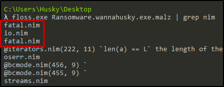
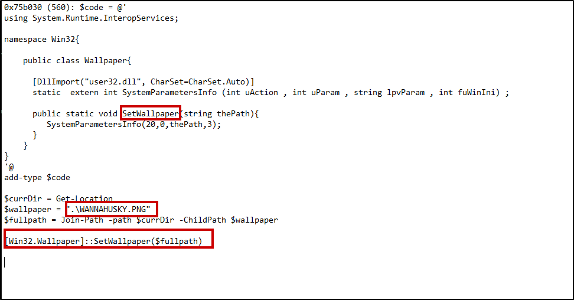

## Executive Summary
WannaHusky is a new Ransomware written in the Nim programming language. It has specific parameters that are checked before it encrypts a target file. There are no network indicators associated with this Ransomware and it does not impact other system processes. 

SHA256: 3d35cebcf40705c23124fdc4656a7f400a316b8e96f1f9e0c187e82a9d17dca3  
MD5: 0287b38f8240a025b30c0a231ea403fc

## Static Analysis
WannaHusky has a 32-bit architecture and multiple strings referencing Nim. 

Multiple strings reference a PowerShell file on the Desktop.

  > @tree C:\

  > @Desktop\ps1.ps1

  > @powershell

  > @Desktop\ps1.ps1

  > @$code = @'
  
This file is likely a payload dropped by the executable. In the strings we also see PowerShell code.

This payload imports user32.dll and contains a function called "SetWallpaper", which takes in an argument called "thePath". This is very likely the path to the current directory given the variable $currDir pointing to the current location. The full path is created, ending in "WANNAHUSKY.PNG" and the SetWallpaper function is called on that. 

Additional strings point to a file on the Desktop called cosmo.jpeg.

> @COSMO

> @Desktop\target\cosmo.WANNAHUSKY

> @Desktop\cosmo.jpeg

This file is the target of the Ransomware and is encrypted by it. 
