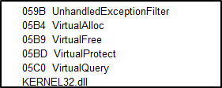
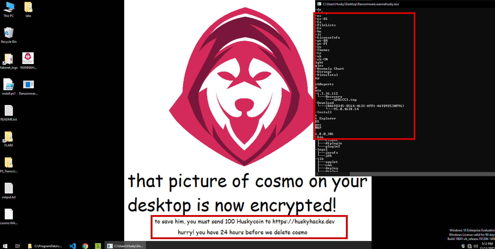
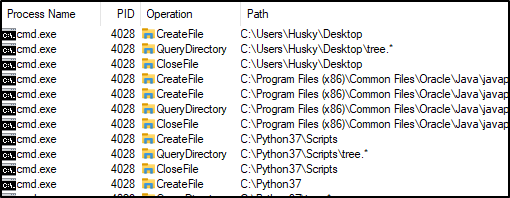

## Executive Summary
WannaHusky is a new Ransomware written in the Nim programming language. It has specific parameters that are checked before it encrypts a target file. There are no network indicators associated with this Ransomware and it does not impact other system processes. 

SHA256: 3d35cebcf40705c23124fdc4656a7f400a316b8e96f1f9e0c187e82a9d17dca3  
MD5: 0287b38f8240a025b30c0a231ea403fc

## Static Analysis
WannaHusky has a 32-bit architecture and multiple strings referencing Nim. 

Multiple strings reference a PowerShell file on the Desktop.

> @powershell
> 
> @Desktop\ps1.ps1
  
This file is likely a payload dropped by the executable. In the strings we also see PowerShell code.

This payload imports user32.dll and contains a function called "SetWallpaper", which takes in an argument called "thePath". This is very likely the path to the current directory given the variable $currDir pointing to the current location. The full path is created, ending in "WANNAHUSKY.PNG" and the SetWallpaper function is called on that. 

Additional strings point to a file on the Desktop called cosmo.jpeg.

> @COSMO
>
> @Desktop\target\cosmo.WANNAHUSKY
>
> @Desktop\cosmo.jpeg

This file is the target of the Ransomware and is encrypted by it. 

Examining the Import Address Table, there are functions for allocating memory, likely suggesting that a new process will be spawned by the executable. 

## Detonation

Initial detonation shows the background changing to the WannaHusky ransom note while the "tree" command runs on the command prompt. This command lists every directory and sub-directory on the system. It is unclear whether this was supposed to encrypt files it detected or is just used as a scare tactic to encourage payment. The threat actor demands 100 Huskycoins sent to "huskyhacks[.]dev" or else the target image will not be decrypted. 

No other behaviors were noticed during detonation.

## Dynamic Analysis

No network traffic was identified in WireShark or in TCPview.

 While running Procmon, the Cosmo file is observed being targeted as well as the new Powershell script being launched.

The command prompt is also launched as a child process of WannaHusky. It appears to search for various "tree" programs on the network before finding the intended one that lists all directories. During this analysis, a Debugger was used to halt execution of the program after the initial PowerShell payload was saved to the Desktop. This led to the confirmation that it was the same payload found during static analysis. 

Utilizing ProcessHacker, we can see the program execution at a higher-level. WannaHusky launches both conhost and cmd.exe, the latter of which spawns the PowerShell. 

No Advanced Static Analysis was undertaken. 

## Detection

Adding YARA rules.

